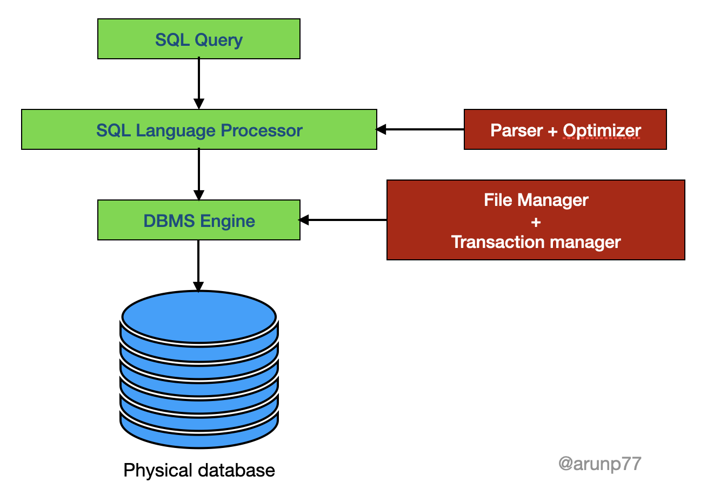

🗒️ Table of content

- Query Languages (QL)
- Introduction to SQL
- Need of SQL
- Advantages of SQL
- Disadvantages of SQL
- Comparsions
  - SQL and NoSQL
  - MySQL and BigQuery
- References

------------
# Query Languages (QL)

Query Languages (QL) are programming languages specifically designed for querying and manipulating data in a database management system (DBMS). They provide a standardized syntax and set of commands to interact with the database and retrieve the desired information. Here are some commonly used query languages:

- **SQL (Structured Query Language):** SQL is the most widely used and standardized query language for relational databases. It allows users to define, manipulate, and query data stored in tables. SQL provides commands such as SELECT, INSERT, UPDATE, DELETE, and JOIN to perform operations on the database. It supports filtering, sorting, grouping, and aggregating data to retrieve specific information.

- **XQuery:** XQuery is a query language designed for XML (eXtensible Markup Language) databases. It allows users to query and transform XML data. XQuery provides a flexible and expressive syntax for navigating XML structures, extracting specific elements or attributes, and performing filtering and sorting operations.

- **SPARQL:** SPARQL is a query language for querying data in RDF (Resource Description Framework) databases, which store data in a graph-like structure. It allows users to retrieve and manipulate data using graph patterns and triple-based queries. SPARQL provides mechanisms for querying semantic data and performing graph-based operations.

- **MDX (Multidimensional Expressions):** MDX is a query language specifically designed for querying multidimensional databases, such as OLAP (Online Analytical Processing) systems. It enables users to retrieve and analyze data stored in cubes, dimensions, and measures. MDX supports complex calculations, drill-down operations, and advanced analytics on multidimensional data.

- **Cypher:** Cypher is a query language for querying graph databases, such as Neo4j. It provides a concise and expressive syntax for traversing and querying graph structures. Cypher allows users to define patterns, relationships, and properties to retrieve and manipulate graph data. It supports operations like node matching, relationship filtering, and graph path exploration.

- **LINQ (Language-Integrated Query):** LINQ is a query language embedded in programming languages like C# and VB.NET. It provides a unified syntax for querying various data sources, including relational databases, XML, and collections. LINQ enables developers to write type-safe queries using familiar programming constructs, facilitating seamless integration between data and application code.

These query languages offer different syntaxes, features, and capabilities, catering to specific database technologies and data models. Each language provides a standardized way to express queries and retrieve information from the underlying database system. The choice of query language depends on the database technology being used and the nature of the data stored in the database.

# An introduction to SQL: a beginner’s guide

**Definition:** SQL (Structured Query Language) is a widely used programming language designed for managing and manipulating relational databases. It provides a standardized syntax and set of commands for creating, querying, modifying, and managing the data stored in a relational database management system (RDBMS). SQL allows users to interact with databases to retrieve, insert, update, and delete data, as well as perform various operations and transformations.

## Need of SQL 

SQL (Structured Query Language) is essential for several reasons, making it a fundamental tool for working with relational databases. Here are some key reasons for the need of SQL:

1. **Data Management:** SQL allows for efficient and effective management of large volumes of structured data. It provides a standardized language for creating, organizing, and manipulating databases. With SQL, you can define the structure of your data, store and retrieve data, update and modify existing data, and perform complex queries and analysis.

2. **Data Retrieval and Analysis:** SQL provides powerful querying capabilities, allowing you to retrieve specific data from one or more tables using various filtering and sorting techniques. SQL's SELECT statement allows you to specify precisely what data you need and how it should be presented. It supports aggregations, grouping, and sorting functions, enabling you to perform advanced data analysis and generate meaningful insights.

3. **Data Integrity and Security:** SQL includes features to enforce data integrity and ensure the consistency, accuracy, and reliability of data. Constraints, such as primary keys, foreign keys, and unique constraints, maintain the relationships between tables and prevent invalid data entries. SQL also supports user authentication, access control, and data encryption, ensuring data security and protecting sensitive information.

4. **Data Modification and Manipulation:** SQL enables you to add, update, and delete data in relational databases. Using SQL's INSERT, UPDATE, and DELETE statements, you can modify data records, add new data entries, or remove unnecessary data. SQL's ability to modify data provides flexibility in managing changing business requirements and maintaining an up-to-date and accurate database.

5. **Data Integration:** SQL facilitates data integration by enabling data from multiple sources to be combined into a unified view. With SQL's JOIN operations, you can merge data from different tables based on common keys or relationships. This capability is crucial for businesses that deal with multiple data sources and need to consolidate and analyze data from various systems.

6. **Database Administration:** SQL plays a vital role in database administration tasks. DBAs (Database Administrators) use SQL to create and manage database objects, define user permissions and roles, optimize database performance, monitor resource utilization, and backup and restore databases. SQL's administrative capabilities make it essential for efficiently managing and maintaining databases.

7. **Application Development:** SQL is often used in conjunction with programming languages to develop database-driven applications. Many programming languages provide APIs and libraries that allow SQL statements to be embedded in code, enabling seamless communication between the application and the database. SQL provides the necessary tools for developers to interact with databases, store and retrieve data, and perform database operations within their applications.

Overall, SQL is crucial for effective data management, data analysis, data integration, and database administration. It provides a standardized and efficient way to work with relational databases, making it an essential tool for businesses and organizations that rely on structured data for their operations and decision-making processes.

## Some of the advantages of SQL

SQL (Structured Query Language) offers several advantages that make it a popular choice for working with relational databases. Here are some key advantages of SQL:

- **Ease of Use:** SQL has a straightforward and easy-to-understand syntax, making it accessible to both beginners and experienced developers. Its declarative nature allows users to specify what data they want, rather than how to retrieve it. This simplicity reduces the learning curve and allows for efficient data manipulation and retrieval.

- **Universal Standard:** SQL is a widely adopted standard for working with relational databases. It is supported by most relational database management systems (RDBMS), including popular ones like Oracle, MySQL, Microsoft SQL Server, PostgreSQL, and SQLite. The universal adoption of SQL means that skills and knowledge acquired in one database system can be easily transferred to another.

- **Flexibility in Data Retrieval:** SQL offers powerful querying capabilities, allowing users to retrieve specific data from one or more tables using various criteria. With SQL's SELECT statement, you can filter, sort, aggregate, and join data, enabling complex data retrieval and analysis. This flexibility allows users to extract valuable insights from large datasets efficiently.

- **Data Integrity and Security:** SQL provides mechanisms to enforce data integrity and ensure the accuracy and consistency of data. Constraints, such as primary keys, foreign keys, and unique constraints, maintain the relationships between tables and prevent the insertion of invalid data. SQL also supports user authentication, access control, and data encryption, ensuring data security and protection.

- Scalability and Performance Optimization: SQL allows for efficient scaling of databases as data volumes grow. It supports indexing, which enhances data retrieval speed, and provides tools for query optimization and performance tuning. These features help improve the overall performance of database systems and ensure efficient handling of large datasets.

- **Data Consistency and ACID Transactions:** SQL supports ACID (Atomicity, Consistency, Isolation, Durability) properties, which ensure that database transactions are reliable and consistent. ACID transactions guarantee that multiple operations either succeed entirely or fail entirely, maintaining data integrity and preventing partial or inconsistent updates.

- **Integration with Programming Languages:** SQL can be seamlessly integrated with various programming languages through APIs and libraries. This integration allows developers to embed SQL statements within their code and interact with databases from their applications. It provides a standardized and efficient way to communicate with the database, store and retrieve data, and perform database operations.

- **Data Analysis and Reporting:** SQL's querying capabilities make it well-suited for data analysis and reporting tasks. It enables users to aggregate, summarize, and transform data, supporting advanced analytics and generating meaningful insights. SQL can be used to generate customized reports, perform calculations, and visualize data for decision-making purposes.

## Disadvantages of SQL

With the advantages of SQL, it also has some disadvantages, which are as follows:

- **Complexity:** SQL can be complex and difficult to learn, especially for those who are new to programming.
- **Limited scalability:** SQL databases can struggle with scalability when it comes to handling large volumes of data, especially when compared to NoSQL databases.
- **Limited flexibility:** SQL databases are designed to handle structured data, which means they may not be as flexible as NoSQL databases when it comes to handling unstructured or semi-structured data.
- **Cost:** SQL databases can be expensive, especially when using commercial database management systems.
- **Security concerns:** SQL databases can be vulnerable to SQL injection attacks, which can result in data loss or corruption.
- **Performance issues:** SQL databases can experience performance issues, especially when complex queries are involved. This can be exacerbated when dealing with large data sets.

## Comparison

### SQL (Relational) and NoSQL

|       | RDBMS SQL	| NoSQL (Not only SQL) RDBMS|
|-------|-------|---------------|
| Data Model	| Relational	| Flexible, unstructured |
| Query Language	| SQL	| Database-specific |
| Type | database are table-based | database are documents based, key-value pairs, graph database |
| Scalability	| Limited vertical	| Highly scalable horizontal |
| ACID	| Supports ACID	| Eventual consistency, eventual transactions |
| Schema	| Defined schema	| Dynamic schema |
| Performance	| Good for complex queries	| Good for high volume, low latency |
| Data Types	| Structured	| Unstructured, semi-structured |
| Examples	| MySQL, PostgreSQL	| MongoDB, Cassandra, Redis |

### MySQL and BigQuery

MySQL and BigQuery are both relational database management systems (RDBMS), but they have several differences in terms of their architecture, functionality, and usage. Here are some of the key differences between MySQL and BigQuery:

1. **Architecture:** MySQL is a traditional client-server RDBMS, which means it is installed on a server and users connect to it using a client application. On the other hand, BigQuery is a cloud-based data warehouse, which means it is hosted on Google Cloud and accessed through a web interface or API.

2. **Scalability:** BigQuery is highly scalable and can handle petabytes of data, while MySQL is generally limited by the hardware it is installed on.

3. Query Language: Both systems use SQL as their query language, but BigQuery has some additional functions and features that are specifically designed for working with large datasets.

4. **Cost:** MySQL is open-source and free to use, while BigQuery is a paid service that charges based on the amount of data processed and storage used.

5. **Use Cases:** MySQL is often used for small to medium-sized applications that require a traditional RDBMS, while BigQuery is designed for large-scale data warehousing and analytics projects.

Overall, while both MySQL and BigQuery are RDBMS systems, they have different architectures, features, and use cases, and are often used for different types of projects.

## SQL tools

There are several SQL tools available that help developers, database administrators, and data analysts work with relational databases and execute SQL queries efficiently. These tools provide user-friendly interfaces, advanced functionalities, and productivity-enhancing features. Here are some commonly used SQL tools:

1. **SQL Server Management Studio (SSMS):** SSMS is a graphical user interface (GUI) tool provided by Microsoft for managing and querying SQL Server databases. It offers a comprehensive set of features, including query editing, database administration, object management, data visualization, and performance tuning.

2. **MySQL Workbench:** MySQL Workbench is an official graphical tool for MySQL database management. It provides a visual interface for designing and modeling databases, SQL development, and administration tasks. It includes features like query editing, database modeling, server configuration, and performance monitoring.

3. **pgAdmin:** pgAdmin is a popular open-source administration and development platform for PostgreSQL databases. It offers a user-friendly GUI that enables users to manage databases, execute SQL queries, monitor performance, and perform various administrative tasks.

4. **Oracle SQL Developer:** Oracle SQL Developer is a free graphical tool provided by Oracle for working with Oracle databases. It provides a complete integrated development environment (IDE) for database development, administration, and query execution. It includes features like query editing, schema browsing, debugging, and data modeling.

5. **DBeaver:** DBeaver is a universal database tool that supports multiple database management systems, including MySQL, PostgreSQL, Oracle, SQL Server, and more. It provides a consistent interface for managing databases, executing queries, exploring data, and performing administrative tasks across different database platforms.

6. **BigQuerry:** BigQuery is a fully-managed, serverless data warehouse and analytics platform offered by Google Cloud. It is designed to handle large-scale data processing and analysis in a highly scalable and efficient manner. BigQuery allows users to store, query, and analyze massive datasets using SQL-like queries. 

These are just a few examples of SQL tools available in the market. The choice of a SQL tool depends on the specific database management system being used, the required features and functionality, and personal preferences. Each tool has its own strengths and may cater to different user requirements and workflows.

# Reference

1. https://github.com/arunsinp/SQL