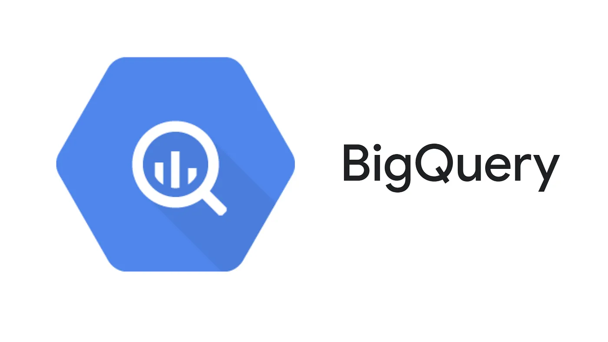

# Google BigQuery

## A Step-by-step Guide to BigQuery

BigQuery is a cloud-based data warehousing and business intelligence service provided by Google Cloud Platform. It enables users to analyze and process large datasets using SQL-like syntax and provides a highly scalable, fast, and cost-effective solution for storing and querying massive amounts of data. With BigQuery, users can perform advanced analytics on data in real-time, build machine learning models, and run complex queries on petabyte-scale data. BigQuery integrates with various data sources and offers powerful features like data visualization, data sharing, and machine learning. It is widely used by businesses, data analysts, and data scientists for processing and analyzing large datasets.

But Going into more details on BigQuery, first let's know what are main query languages used, what is a database, and understand the differences between a few terminologies.

Reference
- https://cloud.google.com/bigquery
- https://github.com/arunsinp/SQL-data-analytics/blob/main/Notes-on-SQL.ipynb
- https://github.com/arunsinp/SQL-data-analytics/blob/main/SQL-Notes.pdf
- https://github.com/arunsinp/SQL-data-analytics