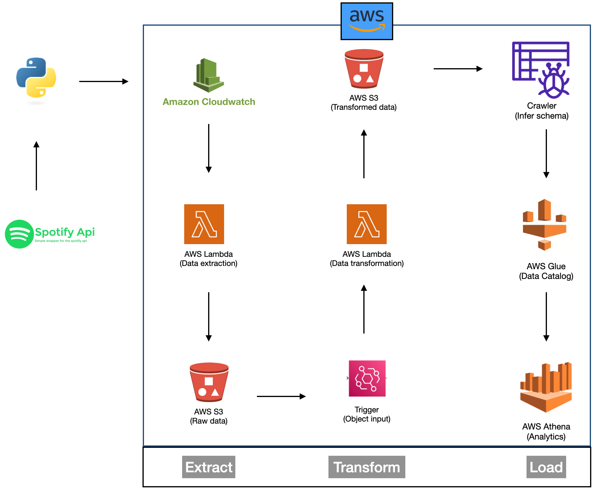

# Spotify ETL Project on AWS

## Overview

This project is an end-to-end ETL (Extract, Transform, Load) pipeline designed to automate the extraction of data from a Spotify playlist and process it using various AWS services. The goal is to showcase proficiency in data engineering and AWS, with a focus on data extraction, transformation, and automated processing.

## Project Architecture

## Project Setup

1. **Spotify Playlist and API:**
    - Created a Spotify API account.
    - Located the target Spotify playlist at [Spotify Playlist Link](https://open.spotify.com/playlist/37i9dQZEVXbNG2KDcFcKOF).

2. **Amazon S3 Bucket:**
    - Set up an Amazon S3 bucket named "spotify-etl-project-arun."

3. **Folder Structure:**
    - Within the S3 bucket, established a structured folder hierarchy:
        - `raw_data/`
            - `processed/`
            - `to_processed/`
        - `transformed_data/`
            - `album_data/`
            - `artist_data/`
            - `songs_data/`

## Key Components

### Data Extraction (AWS Lambda - `spotify_api_data_extract`)

- Created an AWS Lambda function named `spotify_api_data_extract`.
- This function extracts data from the Spotify playlist and saves it in the `raw_data/to_processed/` folder within the S3 bucket.
- The extraction process is performed using the Spotify API.

### Data Transformation and Loading (AWS Lambda - `spotify_transformation_load_function`)

- Developed an AWS Lambda function named `spotify_transformation_load_function`.
- This function handles the transformation and loading of data into distinct folders:
    - `album_data/`
    - `artist_data/`
    - `songs_data/`
- The data transformation involves:
    - Parsing the raw JSON data.
    - Creating separate functions for albums, artists, and songs.
    - Using these functions to transform the data and convert it into dataframes.
    - Applying data cleaning operations such as dropping duplicates and converting data types (e.g., datetime).
    - Saving the transformed data as CSV files in their respective folders.
    
### Automation and Data Update

- To ensure data is kept up-to-date, an automated process is implemented:
    - New data is fetched from the Spotify playlist whenever the playlist is updated.
    - Transformed data is saved in the `raw_data/processed/` folder.
    - The raw data in `raw_data/to_processed/` is deleted, ensuring an updated dataset is always available.

## Project Results

- Insights and observations obtained from the data, such as statistics, patterns, or visualizations.

## Challenges Faced

- Discussion of any challenges encountered during the project and how they were overcome.

## Future Improvements

- Ideas for scaling the project to handle larger datasets and any potential future enhancements.

## Portfolio Presentation

- [Link to your portfolio presentation or document]

## Demo

- [Link to a video demonstration of your project]

## GitHub Repository

- [Link to your GitHub repository where the project code is available]

## Feedback and Contributions

- Mention if you welcome feedback, recommendations, or contributions from the community.

## Contact

- Provide your contact information, such as LinkedIn and email, for inquiries and networking opportunities.

---

Feel free to tailor this template further based on your project's specifics and needs. The `README.md` is a valuable tool for showcasing your work to potential employers, collaborators, and the broader tech community.